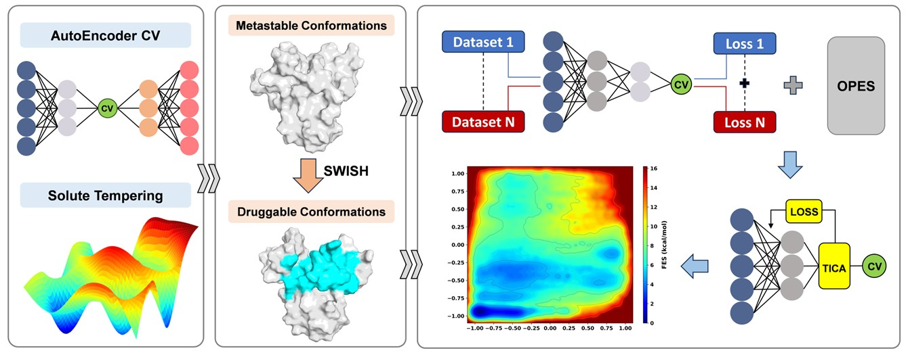

#### Supporting data for the paper:
## "Discovery of a novel AR-NTD antagonist through a machine learning-based enhanced sampling workflow targeting intrinsically disordered proteins"

The training of the models was based on the [mlcolvar library](https://github.com/luigibonati/mlcolvar).

The REST3 tutorial is available here: https://github.com/mdlab-um/REST3_tutorial.

The SWISH tutorial is available here: https://github.com/Gervasiolab/Gervasio-Protein-Dynamics/tree/master/swish_bootcamp.

### Repo structure
The contents of the repository are organized as follows:

#### tau5/REST3 : files for REST3 simulations
  - **0-7**: input files for REST simulations
  - **setup**: script for scaling the top Hamiltonian
  -  **mlcv**: frozen torchscript models for AE CV

#### tau5/swish : files for SWISH simulations
  - **1-9**: input files for SWISH simulations

#### tau5/FES : files for Binding FES simulations
  - **1-9**: input files for Binding FES simulations
  - **1-9/states** Structural files of the free-energy minima conformations
